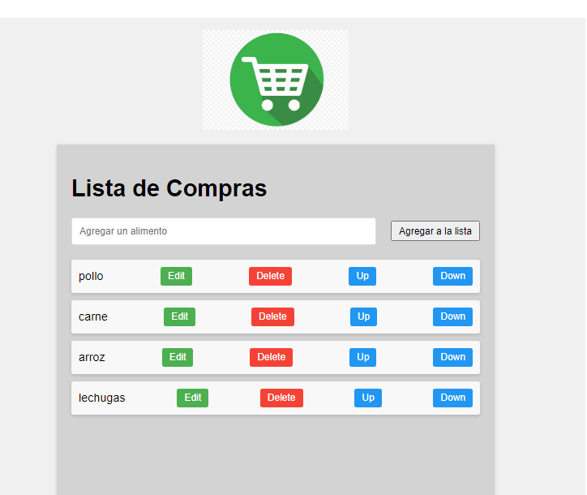
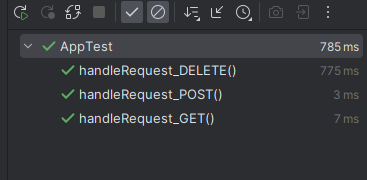

# Taller 1 AREM

Este aplicativo web está diseñado para simular un servidor HTTP capaz de gestionar solicitudes GET, POST y DELETE. El servidor opera en el puerto 8080 y ofrece la funcionalidad de una lista de compras, permitiendo agregar alimentos, editar sus nombres, eliminarlos y reordenarlos según su prioridad.


# Arquitectura
El proyecto tiene una arquitectura Cliente-Servidor con los siguientes componentes:

1. Cliente: El cliente es una aplicación web construida con HTML, CSS y JavaScript. El código del cliente se encuentra en el directorio src/webroot. El archivo index.html es la página principal de la aplicación, y app.js contiene el código JavaScript que maneja la interactividad de la página. Los archivos estáticos (como imágenes y CSS) también se sirven desde este directorio.  
2. Servidor: El servidor es una aplicación Java que maneja las solicitudes HTTP de manera concurrente. El código del servidor se encuentra en el directorio src/main/java/org/example. La clase SimpleHttpServer es el punto de entrada principal del servidor. Esta clase inicia un servidor HTTP en el puerto 8080 y maneja las solicitudes GET, POST y DELETE en hilos separados, permitiendo así el manejo concurrente de múltiples solicitudes.  
3. Construcción y despliegue: El proyecto utiliza Maven para la construcción y el despliegue. Los archivos en src/main/resources se incluyen en el classpath de la aplicación durante la fase de compilación de Maven.

En términos de patrones de diseño, el servidor ahora sigue el patrón de diseño multihilo, donde cada solicitud HTTP entrante se maneja en su propio hilo, permitiendo así el procesamiento concurrente de múltiples solicitudes.
# Instrucciones

Este documento proporciona instrucciones paso a paso para instalar y ejecutar el programa.

## Instalar el aplicativo web

1. Abre una terminal.
2. Navega al directorio donde deseas clonar el repositorio.
3. Ejecuta el siguiente comando para clonar el repositorio:

```bash
git clone https://github.com/username/repository.git
```
4. Abre el directorio del repositorio clonado en tu IDE favorito.
5. Dentro de tu IDE favorito ejecuta el siguiente comando para instalar el proyecto:
```bash
mvn clean install
```
6. El proyecto está listo para ser ejecutado desde la clase SimpleHttpServer e ingresando al enlace: http://localhost:8080/index.html

# Pruebas Automaticas
Ejecuta las pruebas automaticas al instalar el artefacto con mvn o con el comando:

```bash
mvn test
```



Los test están diseñados para probar el método handleRequest de la clase SimpleHttpServer para diferentes tipos de solicitudes HTTP: GET, POST y DELETE. Aquí está lo que hace cada test:  

1. handleRequest_GET: Este test simula una solicitud GET al servidor. Crea una cadena de solicitud GET, la convierte en un InputStream y la pasa al método handleRequest. Luego verifica que la respuesta del servidor contenga "HTTP/1.1 200 OK", lo que indica que la solicitud fue procesada correctamente.
2. handleRequest_POST: Este test simula una solicitud POST al servidor. Al igual que el test anterior, crea una cadena de solicitud POST, la convierte en un InputStream y la pasa al método handleRequest. Luego verifica que la respuesta del servidor contenga "HTTP/1.1 200 OK", lo que indica que la solicitud fue procesada correctamente.  
3. handleRequest_DELETE: Este test simula una solicitud DELETE al servidor. Crea una cadena de solicitud DELETE, la convierte en un InputStream y la pasa al método handleRequest. Luego verifica que la respuesta del servidor contenga "HTTP/1.1 200 OK", lo que indica que la solicitud fue procesada correctamente.

En cada uno de estos tests, se utiliza la biblioteca Mockito para simular (o "mockear") un objeto Socket. Esto permite que los tests se ejecuten sin necesidad de una conexión de red real. Además, se utiliza un ByteArrayOutputStream para capturar la respuesta del servidor, lo que permite verificar que la respuesta es la esperada.